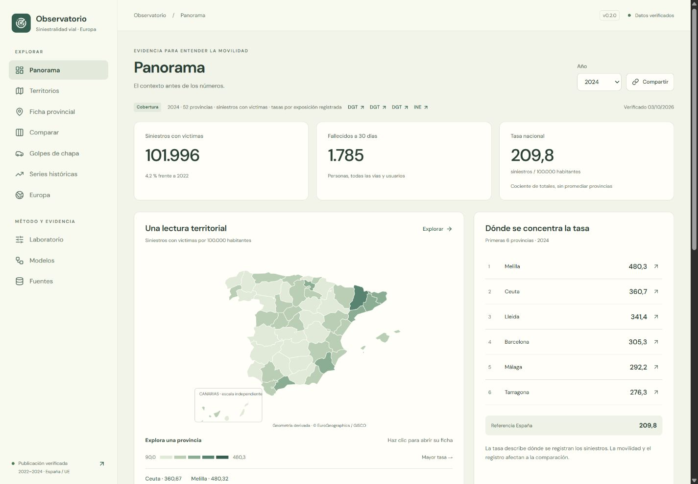
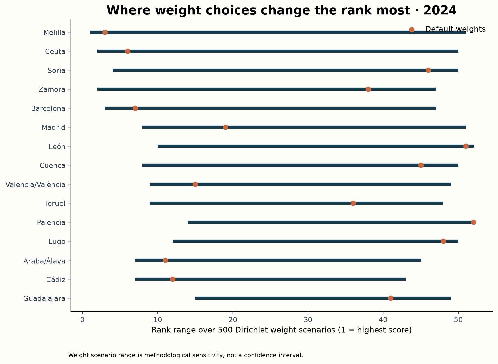
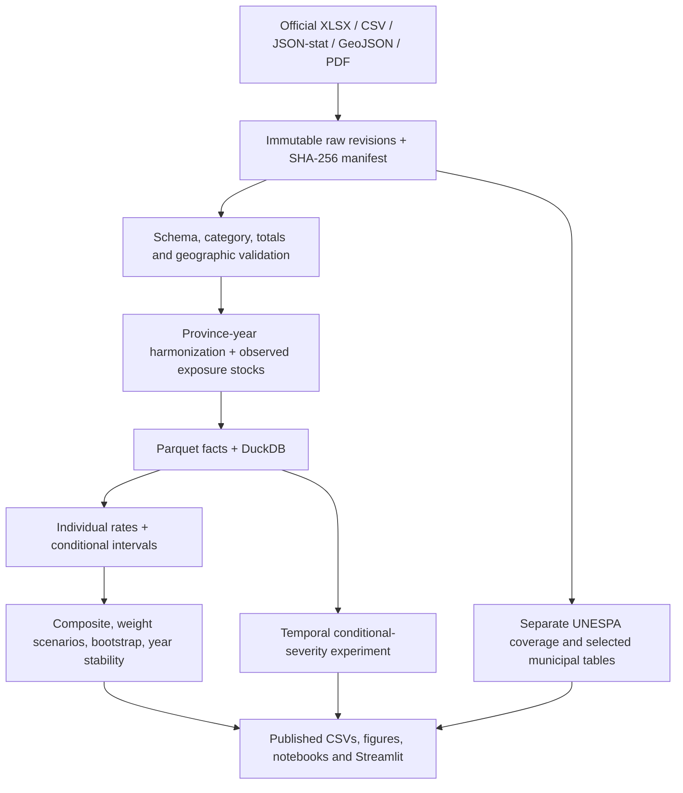

# Observatorio europeo de siniestralidad vial

[Open the observatory](https://javiersaguar.github.io/EUROPEAN-BAD-DRIVERS/) · [Release 0.3.0 / material damage and people](docs/release_0.3.0.md) · [Analytical extension](docs/extended_analysis.md) · [Verification](docs/verification_0.3.0.md)

**Can public data tell us where people drive “worse”—or does the answer change with the measure?**

EBDI turns that question into a reproducible road-safety research project. It combines real DGT crash records, INE population, DGT vehicle/permit stocks and Eurostat mortality data, then tests how territorial rankings change with outcomes, denominators and explicit methodological choices. The Spanish React observatory is the public product; Python and English research documentation provide its reproducible analytical foundation.

The provocative name is a research hook. An experimental composite describes **observed territorial burden**, not the driving ability of residents. A separate **Golpes de chapa** explorer adds real UNESPA material-damage insurance data for 2024, with its own coverage and selection limits.

[](https://github.com/javiersaguar/EUROPEAN-BAD-DRIVERS/actions/workflows/ci.yml)
[](https://github.com/javiersaguar/EUROPEAN-BAD-DRIVERS/actions/workflows/web.yml)
[](https://github.com/javiersaguar/EUROPEAN-BAD-DRIVERS/actions/workflows/monitor.yml)



## New material-damage and demographic analysis

Eleven additional official releases extend the project to **32 registered sources (31 active)**. The new pages include **21 charts**, interpretation, data tables and shareable filters: [material damage](https://javiersaguar.github.io/EUROPEAN-BAD-DRIVERS/?page=material), [people and sex](https://javiersaguar.github.io/EUROPEAN-BAD-DRIVERS/?page=persons), and [accident types](https://javiersaguar.github.io/EUROPEAN-BAD-DRIVERS/?page=circumstances).

Irish NCID records an estimated 193,329.2 material claims in 2024 with matched portfolio exposure; Germany records 2,221,996 police property-only crashes. Spanish tables add 3,780 harmonized sex/age/user cells, distinct victim and involvement populations, crude and age-standardized mortality. The EU sex/user contract has 8,100 keys with missing observations and original flags retained. Sources remain separate: insured claims are not unique crashes, and demographic counts do not identify fault or personal risk. See the [full analysis and source discrepancies](docs/extended_analysis.md) and [executed fifth notebook](notebooks/05_material_and_persons.ipynb). Complete Spanish provincial bodywork claims with insured exposure remain unavailable.

## What the actual analysis found

The audited releases cover **301,218 injury crashes**, **52 Spanish provinces**, **2022–2024**, and **27 EU countries** for a separate mortality comparison.

| Question | Observed result |
|---|---|
| Does counting crashes produce the same ranking as population rates? | 2024 Spearman rank correlation **0.455** |
| Do injury-crash rates and fatality rates agree? | 2024 rank correlation **−0.352**; the measures answer different questions |
| Are reference-index ranks stable across years? | 2022 vs 2024 correlation **0.904** |
| Can changing weights move a province substantially? | Maximum span **50 places** across 500 seeded alternative weight draws |
| What happened nationally in 2024? | **101,996 injury crashes**, **1,785 30-day deaths**, **209.8 injury crashes / 100,000 residents** |

Every result is computed by the pipeline and traceable through [findings](docs/findings.md), [aggregate tables](outputs/tables), [quality report](docs/data_quality.md) and the hashed [source register](configs/sources.yaml). Weight ranges are methodological sensitivity, not confidence intervals.



## Run the observatory

Node 24, no API keys:

```sh
git clone https://github.com/javiersaguar/EUROPEAN-BAD-DRIVERS.git
cd EUROPEAN-BAD-DRIVERS/web
npm ci --ignore-scripts
npm run dev -- --port 8501
```

Thirteen views: material-damage time series in Ireland and Germany, sex/age/user analysis in Spain and the EU, accident categories and vehicle ages, plus overview, provincial rates and matched state-network exposure, province profile, comparison of up to three territories, material-damage insurance, 2010–2024 history, Europe, configurable index, severity models and sources. All filters are shareable. Charts have text/table alternatives; downloads include CSV, PDF, SVG and PNG with provenance and scope. Fonts and derived GISCO cartography are bundled; there is no developer toolbar or Deploy button.

The published aggregates make the app usable immediately without downloading raw crash files. The layout takes inspiration from the quiet console in [HS-Maisa](https://github.com/javiersaguar/HS-Maisa), with original code, assets and design tokens. See [deployment](docs/deployment.md), [the twenty improvements](docs/release_0.2.0.md) and [insurance limits](docs/insurance.md).

The optional legacy research dashboard remains available: install uv, then `uv sync --locked` and `uv run ebdi dashboard` on a different port if React is running. It is not the public production frontend.

## Reproduce the research in stages

Python **3.12** is tested; the lock supports 3.12–3.13. No API keys are needed. All commands work in PowerShell and Unix shells.

```sh
uv run ebdi download                 # cached, hash-verified official files
uv run ebdi process                  # validated facts, Parquet, DuckDB, geometry
uv run ebdi insurance                # UNESPA coverage and selected municipal PDF tables
uv run python scripts/build_reference.py
uv run ebdi analysis                 # EDA, rates, index, sensitivity, original figures
uv run ebdi model                    # temporal model selection and final evaluation
uv run --extra explain ebdi explain  # SHAP on a real held-out sample
uv run ebdi history                 # separate EU-27 mortality context, 2010–2024
uv run ebdi exposure                # matched RCE/state-road panel, 2022
uv run ebdi alternative             # 50/50 injury/mortality index
uv run ebdi policy                  # exploratory validation-selected threshold
uv run ebdi demographics            # audited age/sex/user tables and mortality rates
uv run ebdi material                # German property-only police crashes
uv run ebdi ncid                    # Irish claims, matched policy exposure, deflated costs
uv run ebdi extended-analysis       # categories, intervals, changes and scientific figures
uv run ebdi site                    # versioned public aggregate contract
uv run python scripts/build_notebooks.py
uv run pytest -q
```

`uv run ebdi all` runs the core data/model and observatory aggregate commands. `make install` and `make all` also support the full workflow, including SHAP, executed notebooks and checks. Installation and fresh source downloads need network access; cached analysis runs locally. See [reproduction](docs/reproduction.md) for selective targets, optional Docker, cache revisions and maintenance. Source endpoints can change: audited hash mismatches require review and are never silently accepted.

## Sources and coverage

| Source | Used for | Coverage / limitation |
|---|---|---|
| DGT accident-with-victims microdata and dictionary | Crash, severity, road/collision/time circumstances | 2022–2024, one crash per row; no individual driver demographics or vehicle ages |
| INE annual census, table 67988 | Same-year population denominator | Resident population on 1 January; exposure proxy |
| DGT fleet and resident permit census | Alternative denominators | Audited 2022, 2023 and 2024 stocks; all 156 province-years complete |
| Eurostat `tran_sf_roadus`, `demo_pjan`; ERSO cross-check | EU-27 deaths per million residents | Shared 30-day outcome, 2022–2024; flags retained |
| GISCO NUTS 2024 | Local provincial choropleth | Island polygons explicitly aggregated; cartographic attribution required |
| UNESPA 2024 automobile report | Separate material-damage explorer | National coverage shares/costs, 40 selected cities per coverage and 50 all-coverage provincial totals; no complete municipal claims/exposure panel |
| Insurance Europe / Transport Ministry | Feasibility audit and extension gates | Historical insurance workbook and unmatched road-network VKT; excluded from modern metrics |

The [feasibility audit](docs/data_feasibility.md) preceded implementation. [Sources](docs/sources.md) records exact URLs, retrieval dates, hashes, variables, reuse terms and comparability. [Country-variable metadata](outputs/tables/country_comparability.csv) explicitly records what is included or excluded for each country/year.

## Architecture



Reusable logic lives in `src/ebdi`; notebooks are executed explorations rather than the pipeline implementation. Large raw files, processed facts and fitted model binaries stay local. Public results contain aggregated analysis, not participant identifiers. A full [data dictionary](docs/data_dictionary.md) lists the 73 observed fields, types, missingness and code definitions.

## Metrics and the composite experiment

Individual measures come first: injury crashes, 30-day fatalities, urban crashes, rear/lateral crashes and severe crashes. Rates explicitly use population, registered vehicles or permit holders, with counts and conditional Poisson 95% limits. Crash location and resident/registration stocks do not match individual travel exposure.

Default EBDI weights are **40% injury crashes, 25% urban, 20% rear/lateral and 15% fatalities**, all divided by population and normalized to within-year percentiles. Components overlap. The dashboard lets users change weights and normalization; equal weighting and single-component alternatives are published. Missing active components exclude the province rather than silently changing weights. Z-score, robust z-score and min–max alternatives expose the effects of scale choice.

The latest-year sensitivity analysis uses 500 Dirichlet weight draws and 24 named method scenarios. A separate 200-repeat event bootstrap preserves within-crash overlap while holding population fixed. [Methodology](docs/methodology.md) explains formulas, ties, eligibility, uncertainty assumptions and interpretation.

## A valid, limited ML extension

The target is **at least one fatality or hospitalized injury, conditional on an injury crash being recorded**. There is no exposed cohort of non-crash drivers, so personal annual accident probability cannot be estimated.

Train on 2022, select by 2023 validation log loss, refit on 2022–2023 and evaluate 2024. Compare a prior-frequency dummy, logistic regression and histogram gradient boosting. The selected boosting model achieves **ROC-AUC 0.703, PR-AUC 0.234, log loss 0.296 and Brier 0.083** on 101,996 holdout crashes, with severe-crash prevalence **9.82%**. At the fixed 0.5 threshold recall is only **1.16%**; discrimination alone does not establish operational usefulness.

All candidates' metrics, confusion matrices, calibration bin sizes, holdout permutation importance and an optional seeded SHAP summary are published. No outcome totals or IDs enter predictors. Some circumstances are known only after a crash. Attribution describes model association, not causation. See the [model card](docs/model_card.md).

## Quality, limitations and authorship

Tests cover formulas, zero/missing denominators, geographic joins, temporal mappings, category/schema drift, weights, leakage, cache integrity, aggregate conservation and dashboard behavior. GitHub Actions checks Windows/Linux and executes the five notebooks without downloading national raw files on every push.

The central limits are injury-only reporting, imperfect exposure proxies, overlapping components, a short Spanish injury-crash window, and differing registration systems. Complete municipal claims/exposure panels, full-network vehicle-kilometres and demographic involvement risk require additional audited sources; the new national demographic tables analyze registered people without estimating involvement risk. The separate [insurance explorer](docs/insurance.md) preserves the selection and definition limits of UNESPA's published 2024 tables. See [limitations](docs/limitations.md) and the honest [publication draft](docs/publication_note.md).

**Author: Javier Saguar.** Delivery follows six [stages](docs/stages.md). Commits use Javier's author identity, without co-author trailers. Original code is [MIT licensed](LICENSE); underlying datasets retain their own reuse terms. Credit DGT, INE, Eurostat/CARE, European Commission/ERSO, UNESPA, Central Bank of Ireland, Destatis and © EuroGeographics for applicable cartography. Derived figures identify analysis choices and source coverage.
