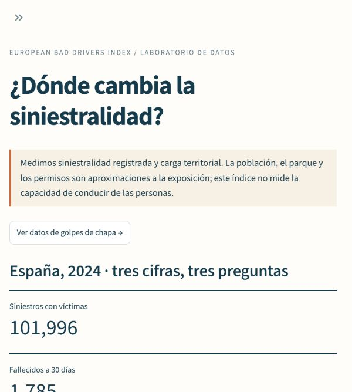
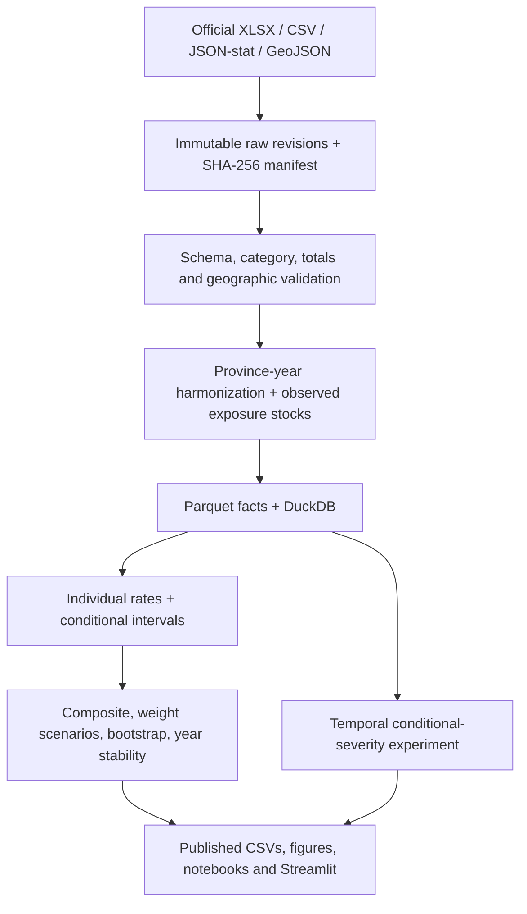

# European Bad Drivers Index

**Can public data tell us where people drive “worse”—or does the answer change with the measure?**

EBDI turns that question into a reproducible road-safety research project. It combines real DGT crash records, INE population, DGT vehicle/permit stocks and Eurostat mortality data, then tests how territorial rankings change with outcomes, denominators and explicit methodological choices. The Spanish dashboard is an interactive companion to the English research documentation.

The provocative name is a research hook. An experimental composite describes **observed territorial burden**, not the driving ability of residents. Ordinary property-damage insurance claims are outside the injury-crash dataset; the feasibility audit documents why they cannot be mixed into this release.

[](https://github.com/javiersaguar/EUROPEAN-BAD-DRIVERS/actions/workflows/ci.yml)

## What the actual analysis found

The audited releases cover **301,218 injury crashes**, **52 Spanish provinces**, **2022–2024**, and **27 EU countries** for a separate mortality comparison.

| Question | Observed result |
|---|---|
| Does counting crashes produce the same ranking as population rates? | 2024 Spearman rank correlation **0.455** |
| Do injury-crash rates and fatality rates agree? | 2024 rank correlation **−0.352**; the measures answer different questions |
| Are reference-index ranks stable across years? | 2022 vs 2024 correlation **0.904** |
| Can changing weights move a province substantially? | Maximum span **50 places** across 500 seeded alternative weight draws |
| What happened nationally in 2024? | **101,996 injury crashes**, **1,785 30-day deaths**, **209.8 injury crashes / 100,000 residents** |

Every result is computed by the pipeline and traceable through [findings](docs/findings.md), [aggregate tables](outputs/tables), [quality report](docs/data_quality.md) and the hashed [source register](configs/sources.yaml). Weight ranges are methodological sensitivity, not confidence intervals.


## Run the dashboard

Install [uv](https://docs.astral.sh/uv/), then:

```sh
git clone https://github.com/javiersaguar/EUROPEAN-BAD-DRIVERS.git
cd EUROPEAN-BAD-DRIVERS
uv sync --locked
uv run ebdi dashboard
```

Published aggregate CSVs make the dashboard usable immediately. The Spain map becomes available after downloading and processing the source geography. The seven views cover overview, selectable territorial measures/denominators, configurable index weights, temporal comparisons, EU mortality, conditional-severity models, and visible methodology/source coverage. CSV downloads include counts and denominators.



## Reproduce the research in stages

Python **3.12** is tested; the lock supports 3.12–3.13. No API keys are needed. All commands work in PowerShell and Unix shells.

```sh
uv run ebdi download                 # cached, hash-verified official files
uv run ebdi process                  # validated facts, Parquet, DuckDB, geometry
uv run python scripts/build_reference.py
uv run ebdi analysis                 # EDA, rates, index, sensitivity, original figures
uv run ebdi model                    # temporal model selection and final evaluation
uv run --extra explain ebdi explain  # SHAP on a real held-out sample
uv run python scripts/build_notebooks.py
uv run pytest -q
```

`uv run ebdi all` runs the four core data/model commands. `make install` and `make all` also support the full workflow, including SHAP, executed notebooks and checks. Installation and fresh source downloads need network access; cached analysis runs locally. See [reproduction](docs/reproduction.md) for selective targets, optional Docker, cache revisions and maintenance. Source endpoints can change: audited hash mismatches require review and are never silently accepted.

## Sources and coverage

| Source | Used for | Coverage / limitation |
|---|---|---|
| DGT accident-with-victims microdata and dictionary | Crash, severity, road/collision/time circumstances | 2022–2024, one crash per row; no individual driver demographics or vehicle ages |
| INE annual census, table 67988 | Same-year population denominator | Resident population on 1 January; exposure proxy |
| DGT fleet and resident permit census | Alternative denominators | Audited 2022 and 2024 stocks; 2023 stays missing |
| Eurostat `tran_sf_roadus`, `demo_pjan`; ERSO cross-check | EU-27 deaths per million residents | Shared 30-day outcome, 2022–2024; flags retained |
| GISCO NUTS 2024 | Local provincial choropleth | Island polygons explicitly aggregated; cartographic attribution required |
| Insurance Europe / UNESPA / Transport Ministry | Feasibility audit and extension gates | Historical insurance workbook, incomplete current claims panel and unmatched road-network VKT; excluded from modern metrics |

The [feasibility audit](docs/data_feasibility.md) preceded implementation. [Sources](docs/sources.md) records exact URLs, retrieval dates, hashes, variables, reuse terms and comparability. [Country-variable metadata](outputs/tables/country_comparability.csv) explicitly records what is included or excluded for each country/year.

## Architecture



Reusable logic lives in `src/ebdi`; notebooks are executed explorations rather than the pipeline implementation. Large raw files, processed facts and fitted model binaries stay local. Public results contain aggregated analysis, not participant identifiers. A full [data dictionary](docs/data_dictionary.md) lists the 73 observed fields, types, missingness and code definitions.

## Metrics and the composite experiment

Individual measures come first: injury crashes, 30-day fatalities, urban crashes, rear/lateral crashes and severe crashes. Rates explicitly use population, registered vehicles or permit holders, with counts and conditional Poisson 95% limits. Crash location and resident/registration stocks do not match individual travel exposure.

Default EBDI weights are **40% injury crashes, 25% urban, 20% rear/lateral and 15% fatalities**, all divided by population and normalized to within-year percentiles. Components overlap. The dashboard lets users change weights and normalization; equal weighting and single-component alternatives are published. Missing active components exclude the province rather than silently changing weights. Z-score, robust z-score and min–max alternatives expose the effects of scale choice.

The latest-year sensitivity analysis uses 500 Dirichlet weight draws and 24 named method scenarios. A separate 200-repeat event bootstrap preserves within-crash overlap while holding population fixed. [Methodology](docs/methodology.md) explains formulas, ties, eligibility, uncertainty assumptions and interpretation.

## A valid, limited ML extension

The target is **at least one fatality or hospitalized injury, conditional on an injury crash being recorded**. There is no exposed cohort of non-crash drivers, so personal annual accident probability cannot be estimated.

Train on 2022, select by 2023 validation log loss, refit on 2022–2023 and evaluate 2024. Compare a prior-frequency dummy, logistic regression and histogram gradient boosting. The selected boosting model achieves **ROC-AUC 0.703, PR-AUC 0.234, log loss 0.296 and Brier 0.083** on 101,996 holdout crashes, with severe-crash prevalence **9.82%**. At the fixed 0.5 threshold recall is only **1.16%**; discrimination alone does not establish operational usefulness.

All candidates' metrics, confusion matrices, calibration bin sizes, holdout permutation importance and an optional seeded SHAP summary are published. No outcome totals or IDs enter predictors. Some circumstances are known only after a crash. Attribution describes model association, not causation. See the [model card](docs/model_card.md).

## Quality, limitations and authorship

Tests cover formulas, zero/missing denominators, geographic joins, temporal mappings, category/schema drift, weights, leakage, cache integrity, aggregate conservation and dashboard behavior. GitHub Actions checks Windows/Linux and executes the four notebooks without downloading national raw files on every push.

The central limits are injury-only reporting, imperfect exposure proxies, missing 2023 stock denominators, overlapping components, a short temporal window, and differing registration systems. Modern insurance claims, full-network vehicle-kilometres, demographic involvement risk and municipality rankings require additional audited sources. See [limitations](docs/limitations.md) and the honest [publication draft](docs/publication_note.md).

**Author: Javier Saguar.** Delivery follows six [stages](docs/stages.md). Commits use Javier's author identity, without co-author trailers. Original code is [MIT licensed](LICENSE); underlying datasets retain their own reuse terms. Credit DGT, INE, Eurostat/CARE, European Commission/ERSO and © EuroGeographics for applicable cartography. Derived figures identify analysis choices and source coverage.
