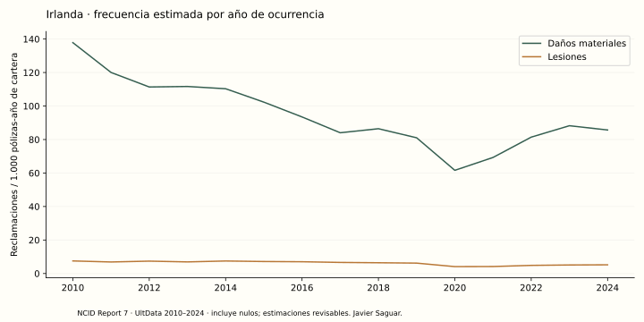
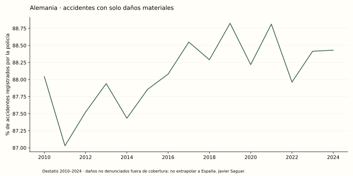
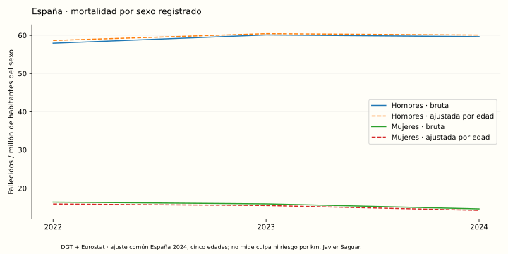

# Daños materiales, categorías y sexo

Versión 0.3.0 · corte de auditoría 4 de octubre de 2026 · autor: Javier Saguar.

Esta ampliación utiliza once publicaciones oficiales adicionales y mantiene separados tres objetos estadísticos: reclamaciones aseguradoras, accidentes policiales y personas registradas en accidentes. Las fuentes se seleccionaron por acceso público reproducible, definiciones documentadas, detalle útil y posibilidad de verificar sus totales. El periodo común termina en 2024; no se interpreta el año de auditoría como año de los accidentes.

## Fuentes seleccionadas

| Fuente | Descarga y ámbito | Variables analizadas | Límite principal |
|---|---|---|---|
| [Central Bank of Ireland, NCID Report 7](https://www.centralbank.ie/statistics/data-and-analysis/national-claims-information-database/ncid-private-motor-insurance) | Anexo XLSX e informe metodológico PDF; seguro privado de automóvil de Irlanda | Estimaciones finales por ocurrencia 2010–2024; liquidaciones materiales 2015–2024; daños propios, a terceros, lunas, incendio/robo y lesiones; costes y pólizas devengadas | Una colisión puede generar varias reclamaciones. Las estimaciones incluyen nulos y no son eventos observados enteros. No hay desglose por sexo |
| [Destatis, publicaciones de accidentes](https://www.destatis.de/DE/Themen/Gesellschaft-Umwelt/Verkehrsunfaelle/Publikationen/_publikationen-verkehrsunfaelle.html) | XLSX de series y anuario; Alemania nacional 2010–2024 y 16 estados por localización en 2024 | Accidentes con víctimas y solo daños; daños materiales graves, otros bajo intoxicantes y restantes | Solo accidentes registrados por la policía; los golpes no denunciados quedan fuera |
| [DGT, tablas estadísticas de 2024](https://www.dgt.es/menusecundario/dgt-en-cifras/dgt-en-cifras-resultados/dgt-en-cifras-detalle/Accidentes-con-victimas-Tablas-estadisticas-2024/) | Tres anuarios XLSX, 2022–2024; España urbana/interurbana | Sexo, edad, usuario, fallecidos a 30 días, heridos hospitalizados/no hospitalizados; conductores víctimas e implicados; 21 tipos de accidente y antigüedad de vehículos | Tablas agregadas nacionales, sin cruce individual ni sexo de quien causó el accidente |
| [Eurostat, mortalidad vial](https://ec.europa.eu/eurostat/cache/metadata/en/tran_sf_road_esms.htm) | JSON-stat `tran_sf_roadus`; UE27 actual, 2010–2024 | Cuatro categorías de sexo y cinco papeles de usuario; todas las edades | Categorías anidadas, banderas nacionales y ausencias; el papel no identifica tipo de vehículo |
| [Eurostat, población](https://ec.europa.eu/eurostat/databrowser/view/demo_pjan/default/table) | JSON-stat `demo_pjan`, sexo/año para UE27 y edades simples para España | Población del mismo sexo/año; ajuste español por edad | Población de 1 de enero, no kilómetros ni tiempo de conducción; sexo desconocido sin denominador |
| [Eurostat, HICP anual](https://ec.europa.eu/eurostat/databrowser/view/prc_hicp_aind/default/table) | Irlanda, índice anual general `CP00`, 2010–2024 | Costes nominales convertidos a euros de 2024 | Inflación general de consumo, no un índice específico de reparación |

Los once identificadores, URLs exactas, hojas, fechas, licencias y SHA-256 están en [sources.yaml](../configs/sources.yaml). El original se conserva por hash en `data/raw/revisions`; una revisión del editor exige auditoría. Los CSV publicados y sus hashes forman el contrato de la web.

## Qué muestran los resultados

### Irlanda: frecuencia, coste y composición

En 2024, los cuatro tipos de daños materiales suman **193.329,2 reclamaciones estimadas**, **85,69 por 1.000 pólizas-año de cartera** y **2.236,24 € nominales por reclamación**. Frente a 2019, el volumen aumenta un **22,42 %**, la frecuencia un **5,73 %**, el coste medio nominal un **75,18 %** y el coste medio en euros constantes de 2024 un **49,21 %**. El coste nominal por póliza aumenta un **85,22 %**. La identidad frecuencia × coste medio reproduce el coste agregado por póliza; no demuestra causas del encarecimiento.

Se utiliza exclusivamente la exposición de **UltData** para esas estimaciones. PremData corresponde a otra base de cartera. El denominador de daños propios puede restringirse a pólizas comprehensive; para las demás coberturas el anexo no proporciona una exposición específica compatible y se presenta solo la frecuencia de cartera. Esto puede incluir varias reclamaciones por póliza y no es una probabilidad individual.

La liquidación es otra cohorte: la tabla 14 contiene **139.433 reclamaciones materiales liquidadas en 2024**, con categorías y costes propios. El accidente puede ser de años anteriores; no se añade la exposición de pólizas de 2024 a ese recuento. La cobertura del mercado informada para 2024 es del **94 % de primas devengadas** para las estimaciones y del **88 %** para liquidaciones; no equivale al porcentaje de conductores. Esos porcentajes no se atribuyen a años anteriores.

Daños propios y a terceros son las categorías más cercanas a colisiones de chapa, pero la fuente no identifica exclusivamente trabajos de chapa/pintura. Lunas, incendio y robo se muestran por separado. Lesiones y sus bandas de coste se conservan como un análisis distinto.



### Alemania: cobertura real de accidentes sin víctimas

En 2024, Destatis registra **2.221.996 accidentes con solo daños materiales**, de **2.512.697 accidentes policiales**: **88,43 %**. Los **290.701 accidentes con víctimas** forman una categoría excluyente. La serie nacional permite comparar 2010–2024; la cuota era 88,82 % en 2019. El peso del daño material depende de ambos recuentos y del registro, por lo que no identifica seguridad individual.

El anuario permite explorar 16 estados y cuatro localizaciones, además de los tres grupos materiales. Los volúmenes no se normalizan por una flota o distancia no observada. Se conservan 68 claves esperadas; una combinación de Berlín no aparece en el original y permanece ausente. Las cifras no se extrapolan a España.



### España: personas, sexo y edad

El panel armonizado tiene **3.780 celdas** de año × zona × población analizada × edad × sexo × usuario. La descarga de bandas originales conserva **30.904 filas**, incluidos sus Totales; estos son padres y no observaciones adicionales que deban sumarse. La web permite elegir todas las víctimas, conductores víctimas o conductores implicados, y cada resultado de gravedad. No se asigna sexo a un accidente completo ni responsabilidad a una persona implicada.

En todas las vías y usuarios de 2024 se publican **1.422 hombres**, **361 mujeres** y **2 personas de sexo desconocido** fallecidas: **1.785 en total**, reconciliados con los microdatos de accidentes. Las tasas brutas son **59,68** y **14,56 fallecidos por millón de habitantes del sexo**, respectivamente. La razón es **4,10**. Aplicando a ambos sexos una distribución común de cinco edades de la población española de 2024, las tasas puntuales son **60,10** y **14,19**, con razón **4,24**.

El ajuste directo es `Σ(peso común de edad × fallecidos de la edad/sexo ÷ población de la edad/sexo) × 1.000.000`. Se usan cinco bandas disjuntas (0–17, 18–24, 25–44, 45–64, 65+) y pesos fijos idénticos en todos los años y sexos. La tasa ajustada excluye edades desconocidas: en 2024, 9 hombres y 2 mujeres fallecidos. Las tasas brutas incluyen esas edades de sexo conocido. Ajustar edad no ajusta distancia, ocupación, frecuencia de conducción o factores sociales; estas razones no son evidencia de culpa ni una comparación de habilidad.



### Categorías de accidente y antigüedad

Las **21 categorías excluyentes** de la tabla 1.3 suman exactamente el total de cada año y zona. Se presentan volumen, cuota y fracción de accidentes mortales entre accidentes con víctimas, junto a su denominador. Los intervalos Wilson del 95 % utilizan accidentes mortales, no número de personas fallecidas. Las categorías con menos de 100 accidentes se identifican; las de denominador cero tienen fracción e intervalo ausentes.

La tabla 8.3 registra **160.345 vehículos de motor implicados** en 2024, incluidos **40.835 de más de 15 años** y **41.578 de edad desconocida**. La cuota usa todas las edades, incluidos desconocidos. Sin flota o kilómetros por antigüedad no puede calcularse riesgo por edad del vehículo. No se fuerza un cruce de esa tabla con sexo o tipo de accidente.

### Europa: panel completo de claves, observación parcial

El contrato contiene **8.100 claves** (27 países × 15 años × 4 sexos × 5 papeles), de las que **7.846** tienen fallecidos observados y **5.861** tienen población compatible para calcular tasa. Completar claves no completa observaciones: cada ausencia sigue siendo `null`. El sexo desconocido mantiene sus recuentos sin recibir una población inventada. Los componentes no se suman con TOTAL y las banderas originales siguen en las tablas y descargas.

Los intervalos de Poisson del 95 % se calculan únicamente para recuentos enteros observados con exposición positiva. Tanto esos intervalos como Wilson son intervalos bajo un modelo condicional, no errores de medición de un total administrativo. No se aplican a estimaciones actuariales ni al ajuste de edad puntual. No se publica una clasificación de «mejores conductores» por sexo o país.

## Incidencias originales conservadas

| Publicación | Incidencia auditada | Tratamiento |
|---|---|---|
| NCID 2024 | Tabla 12: 139.415 liquidaciones materiales; tabla 14 y 11: 139.433 | Conservar ambos; usar la tabla 14 para su desglose y documentar diferencia de 18 |
| NCID, bandas de lesiones | Las estimaciones por bandas no particionan exactamente el total publicado | Usar total publicado, nunca sumar bandas con el total |
| DGT 2024, 4.1.U | Las 240 celdas originales de víctimas urbanas en bicicletas están vacías | Ausentes; sin deducción de otras tablas ni conversión a cero |
| DGT 2024, 4.1.1.I | Componentes de vehículo exceden Total: +5 fallecidos, +5 hospitalizados, +13 no hospitalizados | Conservar padres y componentes; diferencias exactas por edad/sexo en `configs/dgt_known_gaps.json` |
| DGT 2024, 4.2.I | Falta el Total de motoristas implicados de 70–74 años | Conservar ausencia; no reconstruir con los sexos publicados |
| DGT 2024, 8.3 | Columna numérica sin etiqueta, 87 vehículos de edad desconocida | Conservar Total; sin tipo inventado ni reparto: 24 interurbanos y 63 urbanos |
| Destatis 2024 | Ausente Berlín, interurbana sin autopistas | Clave presente con valores ausentes; los ceros publicados se distinguen de esta ausencia |

Las verificaciones fallan si aparece una diferencia nueva distinta de las excepciones auditadas. Las particiones incompletas no se certifican como completas. Se muestran avisos junto a los gráficos afectados y auditorías completas en Fuentes.

## Pipeline reproducible y productos

```sh
uv run ebdi download
uv run ebdi demographics
uv run ebdi material
uv run ebdi ncid
uv run ebdi extended-analysis
uv run ebdi site
uv run python scripts/build_notebooks.py
uv run pytest -q
cd web
npm ci --ignore-scripts
npm run build
npm test
npm run test:e2e
```

`ebdi all` integra estas fases después del análisis principal. `make all` añade explicabilidad, notebooks y controles. Las ingestas producen CSV y Parquet; el análisis produce intervalos, ajustes, cambios frente a 2019, cinco figuras científicas SVG y un informe JSON de reconciliación. El quinto notebook ejecutado contiene exploraciones, comprobaciones y las figuras reales. El frontend añade **21 gráficas en tres vistas**, filtros con URL, lectura, fuentes, tablas y exportaciones CSV/PDF/SVG/PNG.

## Lo que sigue sin estar disponible

La fuente pública española de UNESPA sigue siendo una selección de municipios y agregados por cobertura, sin una serie completa de chapa por provincia con vehículos-año asegurados. Los nuevos datasets no resuelven ese vacío español ni ofrecen sexo por reclamación material. Francia y Reino Unido se consideraron para ampliar desgloses de víctimas, pero sus fuentes de víctimas repetirían el ámbito ya cubierto y no resolverían accidentes españoles sin víctimas. La selección prioriza el detalle útil y la comparabilidad, no acumular países con definiciones distintas en una tasa conjunta.

No se usa el sexo para el modelo de gravedad existente: estas son tablas agregadas y no un nuevo conjunto individual de entrenamiento. Tampoco se crean cruces, denominadores, causalidad, responsabilidad ni probabilidades personales ausentes en las fuentes.
